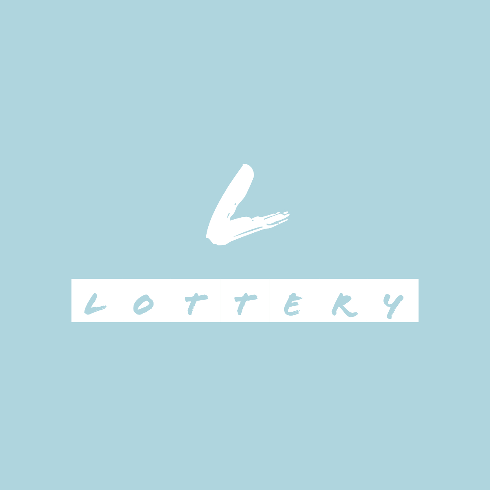
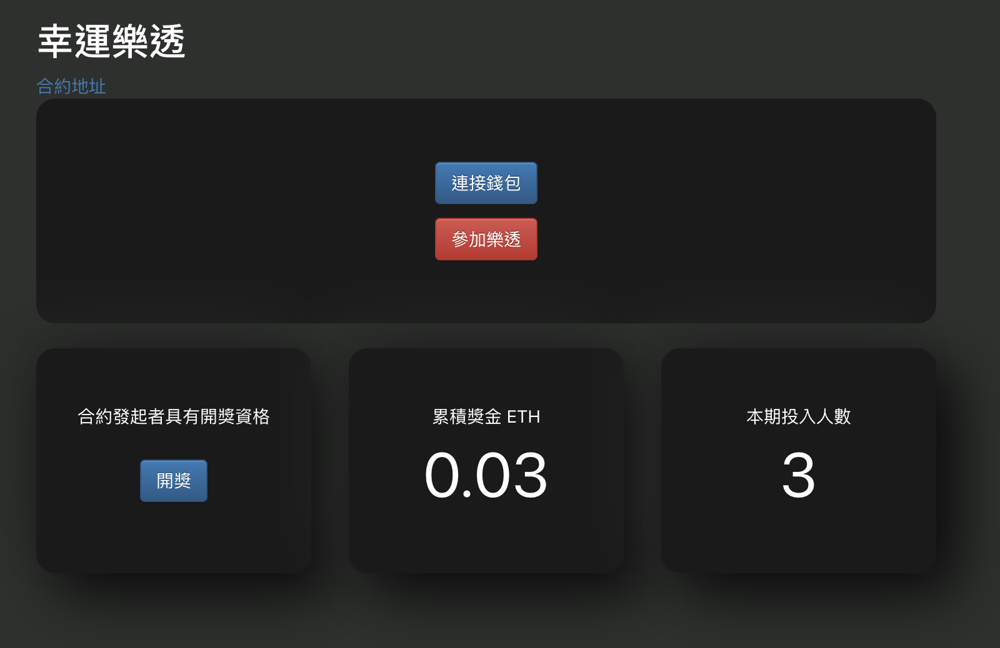

# Lottery Dapp
<a href="https://hazelwu2.github.io/lottery-dapp/">
    
</a>

:star: Star me on GitHub — it motivates me a lot!

[Lottery Dapp](https://hazelwu2.github.io/lottery-dapp/) is a dapp based on react, wagmi, ethers.js, connected with a simple lottery solidty contract.
[Demo](https://hazelwu2.github.io/lottery-dapp/)
<div style="margin-top:40px;">
  
</div>

## Contract Info
- Solidity Version 0.8.2

- Contract Source Code in path `src/contract/lottery.sol`
- [Contract Address](https://rinkeby.etherscan.io/address/0x104c71332295323c1a6264bb17907ff683d0def4)


## How It Works
This project is taken from [Create React App](https://github.com/facebook/create-react-app), Metamask please switch network using Rinkeby.

``` bash
$cd lottery-dapp
$yarn install
$yarn start
```


## Library
Use the following library
- [Create React App](https://github.com/facebook/create-react-app)
- [Wagmi React Hook](https://wagmi.sh/)
- [Ethers.js](https://docs.ethers.io/v5/)
- [React Bootstrap](https://react-bootstrap.github.io/)
- [sweetalert2](https://sweetalert2.github.io/)